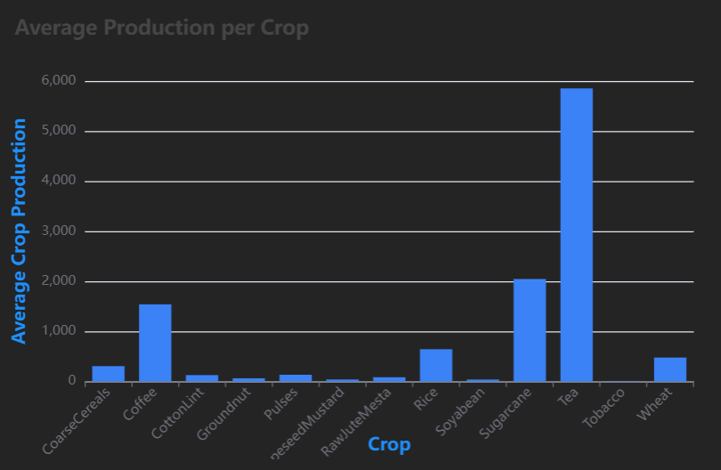
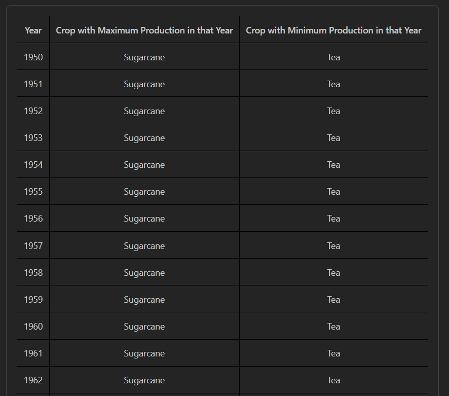

# Indian Agriculture Data Dashboard 

This is a React + TypeScript application using **Mantine v7** and **Apache ECharts**, built to visualize agricultural crop production data.

##  Features

- Displays a **table** of max/min production crops per year.
- Shows a **bar chart** of average crop production.
- Supports **light/dark mode** toggle.
- Fully responsive and clean UI.

---

##  Screenshots

###  Average Crop Production Bar Chart



###  Yearly Max/Min Crop Production Table



> _Screenshots are stored in `/screenshots` folder in the project._

---
### Deployment URL
Live Link (https://agriculturedashboard.netlify.app/)

##  How to Run Locally

### 1. Clone the repository

```bash
git clone https://github.com/your-username/agriculture-dashboard.git
cd agriculture-dashboard
npm install
npm run dev